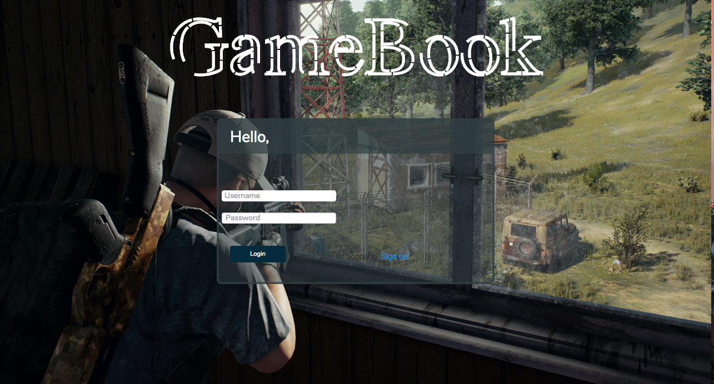
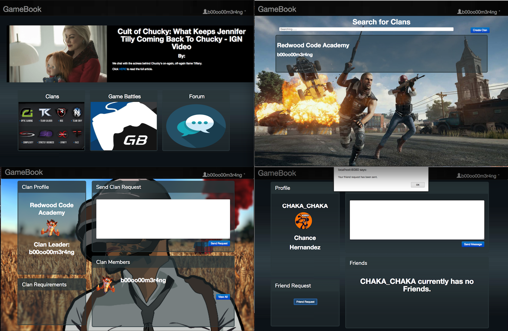

<h1>GameBook</h1>

A social media platform for gamers to connect and communicate with one another. Create a profile, find your friends (or make new ones), create clans, and enjoy playing games with the hundreds of gamers you met!

|  Technologies    |
|-----------------:|
| HTML             |
| CSS              |
| Bootstrap        |
| JavaScript       |
| AngularJS        |
| C#               |
| ASP.NET MVC      |
| Entity Framework |

Developers: Chance Hernandez and Shaneal Prasad

<h3>User Model Example:</h3>

| Parameters | Value                | Description         | Example                         |
|-----------:|----------------------|---------------------|---------------------------------|
| Username   | String               | User`s desired name | "b00oo00m3r4ng"                 |
| Firstname  | String               | User`s firstname    | "Shaneal"                       |
| Lastname   | String               | User`s lastname     | "Prasad"                        |
| Email      | String               | User`s email        | "shanealprasadsp@gmail.com"     |
| Password   | String               | User`s password     | "************"                  |
| Friends    | List of User Objects | User`s friends      | [{users Object},{users Object]] |

<h3>Clans Request Model Example:</h3>

|  Parameters | Value          | Description         | Example                          |
|------------:|----------------|---------------------|----------------------------------|
| user1       | {users Object} | Clan`s desired name | "Redwood Code Academy"           |
| user2       | {users Object} | Clan`s clan leader  | {users Object}                   |
| clan        | {clans Object} | Clan`s clan members | [{users Object},{users Object}]  |
| message     | String         | User messgae        | "I would love to join your clan" |
| RequestType | String         | Request type        | "Clan Request"                   |

<h3>Direct Messages Model Example:</h3>

|  Parameters | Value          | Description                  | Example                                           |
|------------:|----------------|------------------------------|---------------------------------------------------|
| user1       | {users Object} | "User sending the request"   | {users Object}                                    |
| user2       | {users Object} | "User receiving the request" | {users Object}                                    |
| RequestType | String         | Clan`s clan members          | "Direct Message"                                  |
| message     | String         | User message                 | "Hey, have you checked out Redwood Code Academy?" |

<h3>Challenges</h3>
    <ul>
        <li>understanding how to make requests functional</li>
        <li>implementing Esports API</li>
        <li>implementing a 3rd party slider</li>
    </ul>